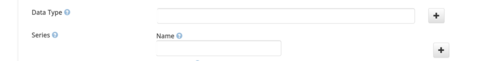

# Data-type Classification of Research Data Files

***Repository dedicated to investigation the classification of data files, according to their content***

## Problem Statement

A file, such as a NetCDF, might contain very different content. It might contain 24h of a remote sensing observation, or multi-year simulation data.

Since EOSC Data Commons intents to make on the possible operations of a file, it is essential that the *type of data* and its *context* is made explicit in a machine-readable manner, so that appropriate actions can be taken.

In order to achieve that is important to agree on vocabularies that describe these *data-types* in an unambigous way, that is accepted by the research domain which makes use of those data-types.

Looking further head, once the classification is agreed upon, it might be possible to automate the classification, using AI methods.  

## Planning

### Stage 1: Landscape Analysis - Vocabularies for Data Types and Formats

**what vocabularies are used to classify data types, by which communities, and through which method?**

* **[EDAM ontology](https://bioportal.bioontology.org/ontologies/EDAM)** and its Data classification and (file) Format classification  
  * Conclusion: limited and idosyncratic list of data formats.
  * research in [docs/EDAM-overview.ipynb](docs/EDAM-overview.ipynb)
  * TODO: what vocabularies reference the EDAM data type classes?
* **[NCBI Data subclasses](https://bioportal.bioontology.org/ontologies/NCIT?p=classes&conceptid=http%3A%2F%2Fncicb.nci.nih.gov%2Fxml%2Fowl%2FEVS%2FThesaurus.owl%23C25474)**
  * TODO:

### Stage 2: Inteagration into Dataverse

Dataverse contains a metadata free-text filed dedicated to describing the Data Type of a Dataset.
However, that field is free text. It would be in the interest of the Data Stations to provide a set of controlled terms (named-entities) to this field. 

# Run Repository code/notebook*

## Python Virtual environment & requirements

In the top directory:

Create a virtual environment `python3 -m venv venv`

Activate it: `source venv/bin/activate`

Install Python requirements: `pip install -r requirements.txt`
