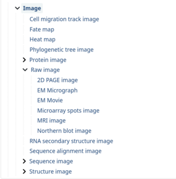

# Data-type Classification of Research Data Files

***Repository dedicated to investigation the classification of data files, according to their content***

## Problem Statement

A file, such as a NetCDF, might contain very different content. It might contain 24h of a remote sensing observation, or multi-year simulation data.

Since EOSC Data Commons intents to make on the possible operations of a file, it is essential that the *type of data* and its *context* is made explicit in a machine-readable manner, so that appropriate actions can be taken.

In order to achieve that is important to agree on vocabularies that describe these *data-types* in an unambigous way, that is accepted by the research domain which makes use of those data-types.

Looking further head, once the classification is agreed upon, it might be possible to automate the classification, using AI methods.  

## Planning

### Stage 1: landscape analysis - Vocabularies

**what vocabularies are used to classify data types, by which communities, and through which method?**

* Start point: EDAM ontology and its [Data classification](https://bioportal.bioontology.org/ontologies/EDAM?p=classes&conceptid=http%3A%2F%2Fedamontology.org%2Fdata_0006)
* files

# Repository code

## Python Virtual environment & requirements

In the top directory:

Create a virtual environment `python3 -m venv venv`

Activate it: `source venv/bin/activate`

Install Python requirements: `pip install -r requirements.txt`
